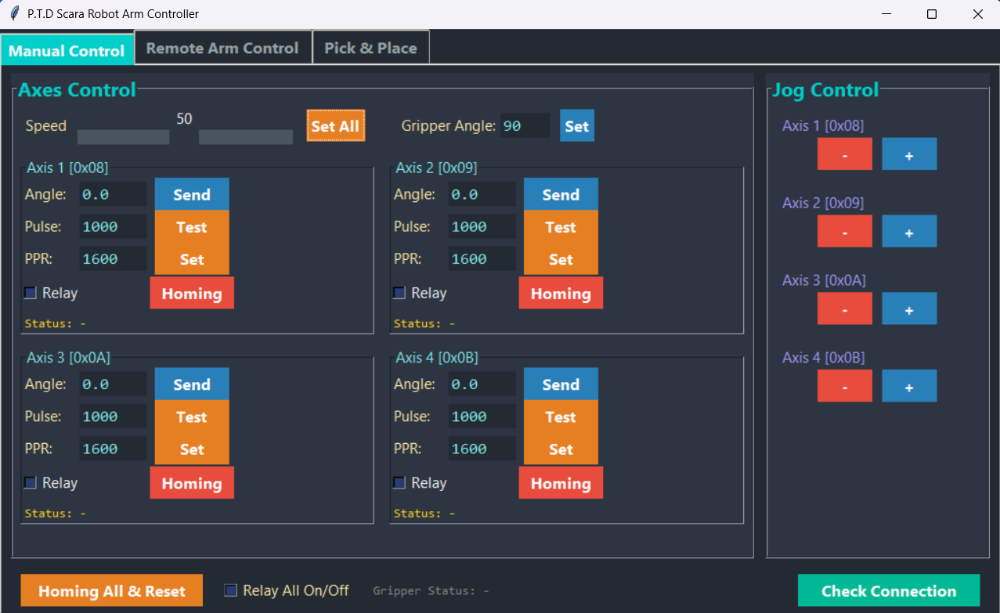
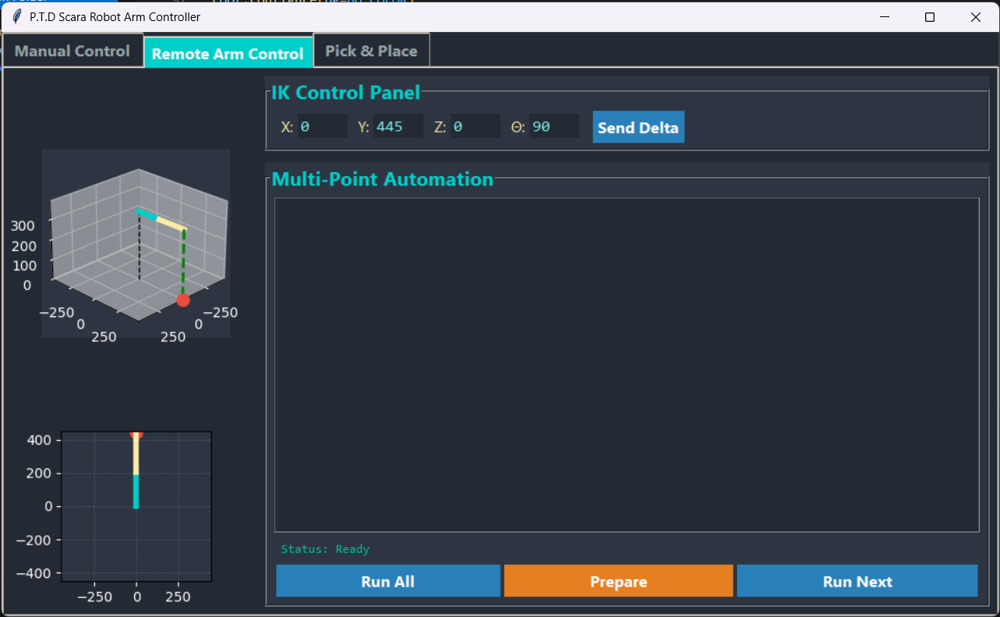
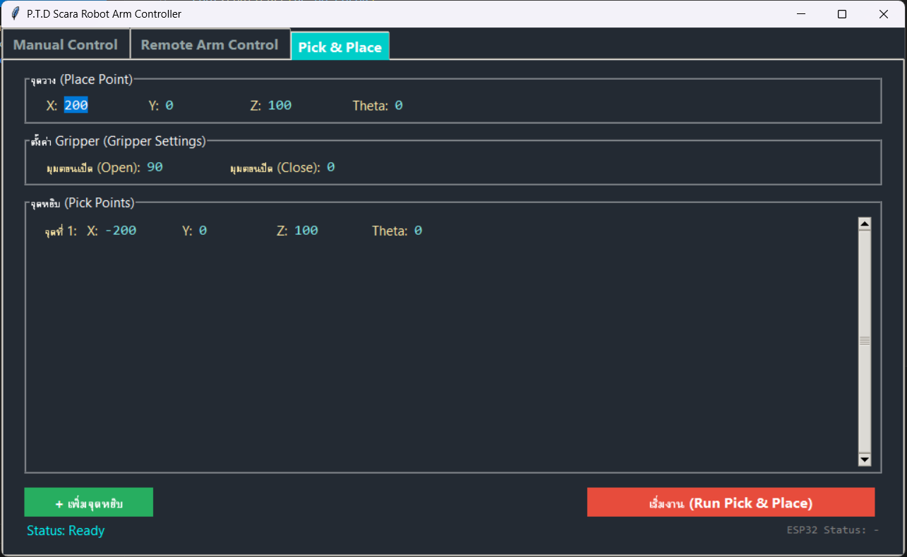

# Design and Optimization of a SCARA Robot Control System

### ปรับปรุงและออกแบบระบบควบคุมหุ่นยนต์ SCARA

> ปริญญานิพนธ์ · วิศวกรรมศาสตรบัณฑิต สาขาเทคโนโลยีวิศวกรรมอิเล็กทรอนิกส์ (เครื่องมือวัดและควบคุม)
> วิทยาลัยเทคโนโลยีอุตสาหกรรม มหาวิทยาลัยเทคโนโลยีพระจอมเกล้าพระนครเหนือ · ปีการศึกษา 2568 (2025)

**ผู้จัดทำ / Authors** — ธีร์ชรัสมิ์ คล้ายนิล · กีรติ ศิษย์ฤาษี · กันตพัฒน์ กลิ่นสุคนธ์
**อาจารย์ที่ปรึกษา / Advisors** — ผศ.ดร.ทิพย์รัตน์ จันทร์สิงห์ · อ.ทรงพล พุ่มแจ่ม

---

## ภาพรวม / Overview

**TH** — ออกแบบระบบควบคุมหุ่นยนต์ SCARA ใหม่โดยแบ่งหน้าที่ระหว่างหน่วยประมวลผลอย่างชัดเจน
Raspberry Pi ทำหน้าที่เป็น **Master Processor** คำนวณจลนศาสตร์ผกผัน (inverse kinematics) และวางแผนการเคลื่อนที่
ส่วน ESP32 ทำหน้าที่เป็น **Joint Processor** ประจำแต่ละแกน รับคำสั่งผ่าน I2C แล้วสร้างสัญญาณพัลส์ควบคุมมอเตอร์เอง
ผลทดสอบพบว่าหุ่นยนต์เคลื่อนที่ถึงตำแหน่งเป้าหมายได้เร็วและแม่นยำ (คลาดเคลื่อนระดับมิลลิเมตรในบางตำแหน่ง)
และทำภารกิจ pick-and-place สำเร็จทุกครั้งอย่างมีเสถียรภาพ รวมถึงอ่านและทำงานตาม G-code ได้

**EN** — A redesigned SCARA control system built around a clear split of responsibilities. A Raspberry Pi acts as
the **master processor**, solving inverse kinematics and planning motion; four ESP32s act as **joint processors**,
each receiving commands over I2C and generating its own step/direction pulse train. Testing showed fast, precise
positioning (millimetre-level error at some poses) and a 100 % success rate on pick-and-place tasks, plus the
ability to interpret G-code.

## สถาปัตยกรรมระบบ / System architecture

```
┌──────────────────────────┐
│  Raspberry Pi 3 B+       │   Master
│  • Tkinter GUI 1024×600  │   • inverse kinematics
│  • matplotlib 3D preview │   • G-code parsing
│  • pigpio → servo gripper│   • motion planning
└────────────┬─────────────┘
             │  I2C  (smbus2)
   ┌─────────┼─────────┬─────────┬─────────┐
   ▼         ▼         ▼         ▼
 0x08      0x09      0x0A      0x0B          Joint processors (ESP32)
 Axis 1    Axis 2    Axis 3    Axis 4        • pulse/dir generation
                                             • homing
                                             • PPR stored in NVS
   │         │         │         │
   ▼         ▼         ▼         ▼
 TB6600 stepper drivers / Yaskawa SGDA AC servo → joints
```

### พารามิเตอร์แขนกล / Arm parameters

| ค่า / Parameter | ค่าที่ใช้ / Value |
|---|---|
| ความยาวแขนท่อน 1 (`l1`) | 210 mm |
| ความยาวแขนท่อน 2 (`l2`) | 235 mm |
| ความสูงฐาน (`z_base`) | 340 mm |
| ชดเชยมุม (`THETA_CORRECTION_OFFSET`) | 9° |
| ความละเอียดมอเตอร์ (PPR) | 1600 pulses/rev (ตั้งค่าใหม่ได้ผ่าน I2C แล้วเก็บถาวรใน NVS) |
| กริปเปอร์เซอร์โว | GPIO 4 · pulse width 500–2500 µs · 0–180° |

### ช่วงความถี่พัลส์แต่ละแกน / Per-axis pulse frequency range

| แกน / Axis | I2C address | ช่วงความถี่ / Frequency range |
|---|---|---|
| 1 | `0x08` | 500 – 4,000 Hz |
| 2 | `0x09` | 100 – 1,000 Hz |
| 3 | `0x0A` | 8,000 – 20,250 Hz |
| 4 | `0x0B` | 40 – 100 Hz |

### โปรโตคอล I2C / I2C command protocol

เฟิร์มแวร์ ESP32 รับคำสั่งเป็นแพ็กเก็ตสั้น ๆ โดยไบต์แรกคือโหมด

| โหมด / Mode | ขนาด / Bytes | ความหมาย / Meaning |
|---|---|---|
| `0x01` | 1 + 4 + 2 | สั่งหมุนเป็นองศา (float) + ความถี่ (uint16) — เครื่องหมายลบคือหมุนกลับทาง |
| `0x02` | 1 + 4 + 2 | สั่งหมุนเป็นจำนวนพัลส์ (int32) + ความถี่ (uint16) |
| `0x03` | 1 + 4 | ตั้งค่า PPR ใหม่ แล้วบันทึกลง NVS ด้วย `Preferences` |

## ฮาร์ดแวร์ / Hardware

- **Raspberry Pi 3 Model B+** — master controller, touch GUI
- **ESP32** ×4 — joint processors (เฟิร์มแวร์ตัวเดียวกัน เปลี่ยนแค่ `SLAVE_ADDR`)
- **Yaskawa SGDA** AC servo + driver
- **TB6600** stepper motor drivers
- **OMRON EE-SX674P-WR** photoelectric sensors — ใช้ทำ homing แต่ละแกน
- **ZRAC2220-11** noise filter
- กริปเปอร์และชิ้นส่วนยึดพิมพ์ 3D เอง

## โครงสร้างไฟล์ / What's in here

| โฟลเดอร์ | เนื้อหา |
|---|---|
| [`software/raspberry-pi/`](software/raspberry-pi/) | [`PTDscara.py`](software/raspberry-pi/PTDscara.py) — โปรแกรมหลักฝั่ง Master: GUI, inverse kinematics, I2C master, servo control |
| [`firmware/esp32/`](firmware/esp32/) | [`FinalESP32Scara.ino`](firmware/esp32/FinalESP32Scara.ino) — เฟิร์มแวร์ joint processor (I2C slave + pulse generator + homing) |
| [`hardware/3d-print/`](hardware/3d-print/) | ไฟล์ STL: กริปเปอร์ 15 ชิ้น, ฝาครอบ, ที่ยึดมอเตอร์, ที่ยึดเซนเซอร์, teach pendant, ฐาน (+ DXF) |
| [`docs/`](docs/) | [เล่มปริญญานิพนธ์ฉบับเต็ม](docs/thesis-full.pdf) · [สไลด์นำเสนอ](docs/presentation-slides.pdf) · [โปสเตอร์](docs/poster.pdf) · [ผังวงจร](docs/circuit-diagram.pdf) · [ลิงก์ datasheet](docs/datasheets.md) |
| [`images/`](images/) | ภาพหน้าจอโปรแกรมควบคุม |

## ไฟล์ CAD ฉบับเต็ม / Full CAD model

โมเดล 3D ทั้งหมดของโปรเจกต์เปิดดูได้บน Onshape:
**[cad.onshape.com — SCARA robot](https://cad.onshape.com/documents/4489548dec43b75017a02eb4/w/150e8646fc0df473b1573c5d/e/71491090db7d655e8ac9f38e)**

## หน้าจอโปรแกรม / Control GUI

| | | |
|---|---|---|
|  |  |  |

## สรุปผล / Results

- เคลื่อนที่ถึงตำแหน่งเป้าหมายได้รวดเร็วและแม่นยำ ยังพบความคลาดเคลื่อนระดับมิลลิเมตรในบางตำแหน่ง
- ภารกิจหยิบจับวัตถุ (pick-and-place) สำเร็จทุกครั้งอย่างมีเสถียรภาพ
- รองรับการอ่าน G-code ทำให้ต่อยอดไปใช้กับงานอัตโนมัติในอุตสาหกรรมได้

**คำสำคัญ / Keywords** — SCARA robot · Raspberry Pi · ESP32 · I2C · Inverse Kinematics · G-code
