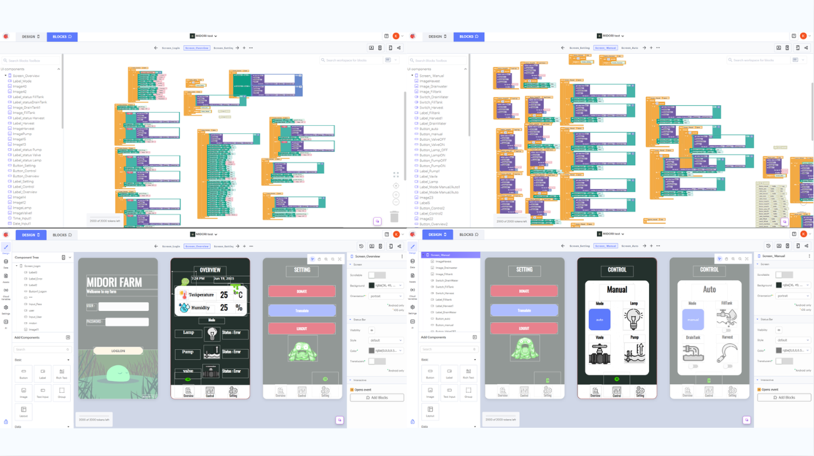

# Midori Wolffia — Automated Duckweed (ไข่ผำ) Farming System

### เครื่องเพาะเลี้ยงไข่ผำโดยระบบ Automation ควบคุมผ่านแอปพลิเคชัน

> *Miniature Superfood of the Future* · **DEC 2024 – FEB 2025**

**Stack** — PLC · ESP32 · Modbus TCP · HMI · Thunkable · Google Sheets

---

## ที่มา / Background

**TH** — ไข่ผำ (Wolffia) เป็นพืชน้ำที่ถูกจัดเป็น superfood เพราะมีโปรตีนสูง โจทย์คือทำให้การเพาะเลี้ยงมีมาตรฐาน
ทั้งด้านความสะอาดและความปลอดภัยของอาหาร แล้วใช้ระบบ automation เข้ามาช่วยเก็บเกี่ยว
เพื่อให้เป็นแหล่งอาหารทางเลือกที่มีคุณค่าทางโภชนาการสูงในอนาคต

**EN** — Wolffia (duckweed) is a high-protein aquatic superfood. This project brings food-safety-grade
consistency to growing it, and automates the harvest — the hardest, most labour-intensive step.

## สถาปัตยกรรมระบบ / System architecture

```
    แอป Thunkable (Android)          Google Sheets (cloud DB)
              │                              ▲
              │  อ่าน/เขียนสถานะ              │  บันทึกค่าเซนเซอร์
              ▼                              │
    ┌──────────────────┐   Modbus TCP   ┌──────────┐
    │      ESP32       │◄──────────────►│   PLC    │──► HMI
    └──────────────────┘                └──────────┘
              │                              │
              ▼                              ▼
    เซนเซอร์อุณหภูมิ–ความชื้น          รีเลย์ · ปั๊มน้ำ · วาล์ว · ไฟเพาะเลี้ยง
```

ฝั่งควบคุมเป็น **PLC** ทำงานร่วมกับ **ESP32** ผ่าน **Modbus TCP** มี **HMI** สำหรับหน้างาน
และใช้ **Google Sheets** เป็นฐานข้อมูลคลาวด์แลกเปลี่ยนข้อมูลกับแอปมือถือแบบเรียลไทม์

## ขอบเขตงาน / Scope

1. วัดอุณหภูมิและความชื้นในห้องเพาะเลี้ยง ดูค่าได้ผ่านแอปพลิเคชัน
2. เปิด–ปิดไฟเพาะเลี้ยงผ่านแอปพลิเคชัน
3. เติมน้ำและลดระดับน้ำด้วยระบบอัตโนมัติ
4. เก็บเกี่ยวไข่ผำด้วยระบบอัตโนมัติ

## หลักการทำงาน / How the harvest works

กลไกเก็บเกี่ยวไม่ใช้แขนกลหรือตะแกรงตัก แต่ใช้ **ระดับน้ำ** เป็นตัวพาผลผลิตออกมาเอง

```
เพาะเลี้ยงที่ระดับน้ำ 10 cm
        │
        ├─► น้ำระเหย/พร่อง ─► เติมน้ำอัตโนมัติกลับมาที่ 10 cm
        │
        └─► ถึงรอบเก็บเกี่ยว
                 │
                 ▼
        เพิ่มระดับน้ำเป็น 13 cm
                 │
                 ▼
        ไข่ผำไหลล้นตามน้ำลงราง ─► ผ้าขาวบางกรองแยกไข่ผำออกจากน้ำ
                 │                        │
                 │                        └─► น้ำไหลลงถังเก็บ นำกลับมาใช้ซ้ำ
                 ▼
        เหลือแม่พันธุ์ไว้ 20% แล้วลดระดับกลับมาที่ 10 cm
```

จุดสำคัญคือ **เก็บแม่พันธุ์ไว้ 20 %** ทุกครั้ง ระบบจึงเพาะต่อเนื่องได้โดยไม่ต้องเริ่มใหม่ และน้ำถูกหมุนเวียนกลับมาใช้ซ้ำทั้งหมด

## แอปพลิเคชัน / Mobile application

แอป Android สร้างด้วย **Thunkable** (เครื่องมือแบบ block-based) แบ่งเป็น 5 หน้าจอ

| หน้าจอ / Screen | ทำอะไร |
|---|---|
| **Login** | เข้าสู่ระบบด้วย user / password |
| **Overview** | แสดงอุณหภูมิ (°C) และความชื้น (%) พร้อมสถานะของ Lamp / Pump / Valve |
| **Control — Manual** | สั่งเปิด-ปิดเองทีละตัว: Lamp, Valve, Pump |
| **Control — Auto** | สั่งงานเป็นชุด: Fill Tank, Drain Tank, Harvest |
| **Setting** | สลับภาษา ออกจากระบบ และอื่น ๆ |



## วัสดุและอุปกรณ์ / Bill of materials

| กลุ่ม | รายการ |
|---|---|
| ชีวภาพ | ไข่ผำ · ปุ๋ยจุลินทรีย์ |
| โครงสร้าง | ถังเพาะเลี้ยง · รางน้ำ · ถังน้ำวน · ท่อ PVC + ข้อต่อ · สายยาง |
| ระบบน้ำ | ปั๊มน้ำ · วาล์วน้ำ · สวิตช์ลูกลอย · ผ้าขาวบาง |
| ระบบไฟ/ควบคุม | ไฟเพาะเลี้ยง · รางไฟ · รีเลย์ · เซนเซอร์วัดอุณหภูมิ–ความชื้น |
| ตัวควบคุม | PLC (+ HMI) · ESP32 · เครือข่าย Modbus TCP |

## โครงสร้างไฟล์ / What's in here

| โฟลเดอร์ | เนื้อหา |
|---|---|
| [`docs/presentation.pdf`](docs/presentation.pdf) | สไลด์นำเสนอฉบับเต็ม 39 หน้า — ที่มา หลักการ แบบร่างเครื่อง และผลการทดลอง |
| [`docs/mobile-app-design.pdf`](docs/mobile-app-design.pdf) | การออกแบบหน้าจอแอปพลิเคชัน |
| [`docs/source-code-listing.pdf`](docs/source-code-listing.pdf) | รวมโค้ดของระบบ |
| [`images/`](images/) | ภาพหน้าจอแอปและ block editor |
