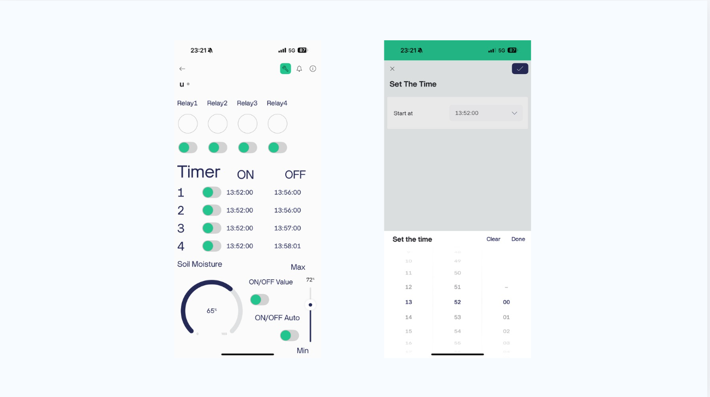

# Automatic Plant Watering System via Mobile Control

### ระบบรดน้ำต้นไม้อัตโนมัติ ควบคุมผ่านมือถือด้วย Blynk

---

## ภาพรวม / Overview

**TH** — ระบบรดน้ำต้นไม้ที่สั่งงานและติดตามสถานะได้จากมือถือ รองรับทั้งการกดเปิด-ปิดเอง ตั้งเวลาแบบรายวัน
และโหมดอัตโนมัติที่ตัดสินใจจากค่าความชื้นในดิน แบ่งการรดน้ำเป็น 4 โซนแยกจากกัน

**EN** — A mobile-controlled irrigation system with four independent zones. Each zone can be switched manually,
scheduled on a daily timer, or handed over to an automatic mode that waters based on live soil-moisture readings.

## ฟีเจอร์ / Features

| ฟีเจอร์ | รายละเอียด |
|---|---|
| **สั่งงานเอง / Manual** | สวิตช์เปิด-ปิดรีเลย์ 4 ตัว (Relay 1–4) สำหรับ 4 โซนรดน้ำ |
| **ตั้งเวลา / Timer** | ตั้งเวลาเริ่มและเวลาหยุดแยกรายโซน เปิด-ปิดแต่ละ timer ได้อิสระ |
| **อ่านค่าความชื้นดิน** | เกจแสดงค่าความชื้นแบบเรียลไทม์เป็นเปอร์เซ็นต์ |
| **โหมดอัตโนมัติ / Auto** | ตั้งเกณฑ์ Min–Max แล้วให้ระบบสั่งรดน้ำเองเมื่อความชื้นต่ำกว่าเกณฑ์ |
| **ควบคุมทางไกล** | ทำงานผ่านแอป Blynk จึงสั่งจากที่ไหนก็ได้ที่มีอินเทอร์เน็ต |

## หน้าจอแอป / App dashboard

หน้าหลักรวมทุกอย่างไว้ในจอเดียว — สวิตช์รีเลย์ 4 ตัวด้านบน, ตารางตั้งเวลา ON/OFF 4 ชุด,
เกจความชื้นดินพร้อมสวิตช์ `ON/OFF Value` และ `ON/OFF Auto` และสไลเดอร์ตั้งค่า Min–Max
ส่วนหน้า *Set The Time* ใช้เลือกเวลาเริ่มทำงานของแต่ละ timer

## เทคโนโลยี / Stack

- **Blynk** — แอปมือถือ + คลาวด์ (virtual pins สำหรับ relay, timer, gauge และ slider)
- **Wi-Fi microcontroller** — เชื่อมต่อ Blynk cloud และควบคุมรีเลย์
- **Soil moisture sensor** — อ่านค่าความชื้นดินป้อนให้โหมดอัตโนมัติ
- **Relay module 4 ช่อง** — ตัดต่อปั๊ม/วาล์วของแต่ละโซน

## โครงสร้างไฟล์ / What's in here

| ไฟล์ | เนื้อหา |
|---|---|
| [`docs/source-code-listing-blynk.pdf`](docs/source-code-listing-blynk.pdf) | รวมโค้ดทั้งหมดของระบบ |
| [`images/blynk-dashboard.png`](images/blynk-dashboard.png) | ภาพหน้าจอแอป Blynk |
