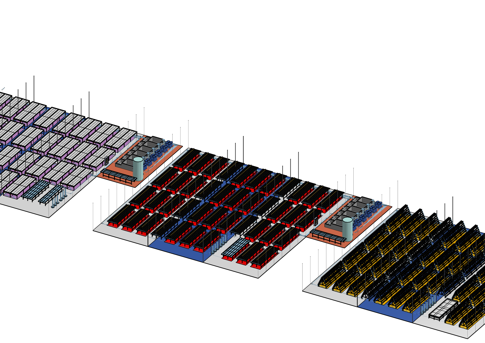
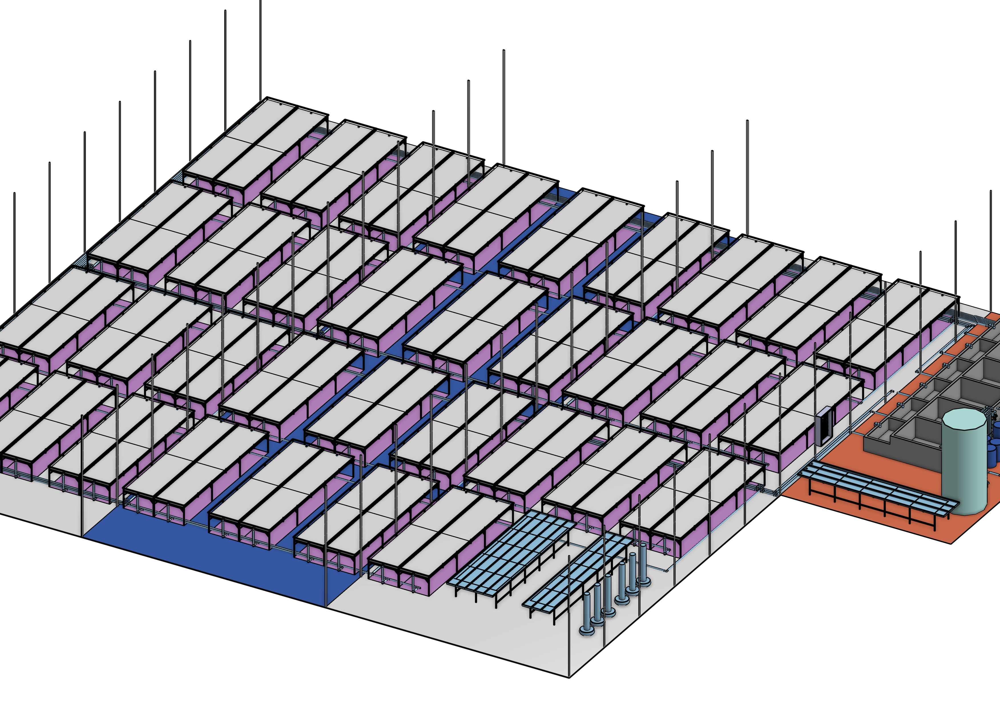
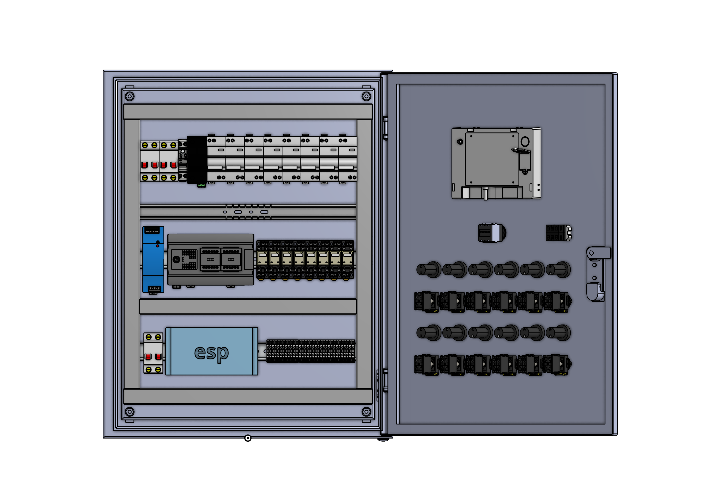
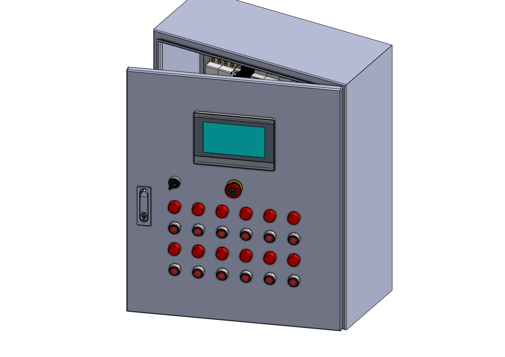

# Prior Solution Co., Ltd. — R&D IoT for Agriculture

### สหกิจศึกษา · บริษัท ไพรเออร์ โซลูชั่น จำกัด

> รายงานการปฏิบัติงานสหกิจศึกษา · วิชา 030513260 Co-Operative Education
> แขนงเครื่องมือวัดและระบบควบคุมอัตโนมัติ ภาควิชาเทคโนโลยีวิศวกรรมอิเล็กทรอนิกส์
> วิทยาลัยเทคโนโลยีอุตสาหกรรม มหาวิทยาลัยเทคโนโลยีพระจอมเกล้าพระนครเหนือ · ภาคเรียนที่ 2/2568

---

## เกี่ยวกับบริษัท / About the company

**Prior Solution Co., Ltd.** เป็นบริษัทด้านเทคโนโลยีสารสนเทศของไทย ก่อตั้งเมื่อ พ.ศ. 2547 สำนักงานใหญ่อยู่ในกรุงเทพมหานคร
ดำเนินธุรกิจด้านการพัฒนาซอฟต์แวร์ ระบบแอปพลิเคชัน และให้บริการโซลูชันด้าน IT สำหรับองค์กรทั้งภาครัฐและเอกชน
🔗 [priorsolution.co.th](https://www.priorsolution.co.th)

## งานที่ได้รับมอบหมาย / What I worked on

**TH** — ทำ R&D ด้านฟาร์มอัจฉริยะ เป้าหมายคือหาโซลูชันที่ **ลดการใช้แรงงานโดยยังคงประสิทธิภาพและความคุ้มค่า**
งานครอบคลุมทั้งฝั่งฮาร์ดแวร์และซอฟต์แวร์:

- **ศึกษาและเปรียบเทียบระบบปลูกพืชแบบไฮโดรโปนิกส์หลายระบบ** — ทดลองจริงเพื่อหาระบบที่มีประสิทธิภาพ คุ้มค่า
  และเหมาะจะพัฒนาต่อเป็นฟาร์มอัตโนมัติ
- **ระบบเติมปุ๋ยอัตโนมัติ** — ออกแบบและพัฒนากลไกจ่ายสารอาหารให้พืช
- **ระบบเซนเซอร์** — เซนเซอร์วัดอุณหภูมิ–ความชื้น และเซนเซอร์วัดค่าต่าง ๆ ในน้ำ
- **แพลตฟอร์มจัดการฟาร์ม** — ฝั่งซอฟต์แวร์สำหรับดูข้อมูลและสั่งงาน
- **ออกแบบโรงเรือน 3D** — โมเดลโรงเรือนและการจัดวางระบบ

**EN** — Smart-farm R&D aimed at cutting manual labour without giving up yield or cost-effectiveness. The work
spanned hardware and software: benchmarking several hydroponic systems against each other, building an automatic
fertiliser-dosing system, temperature/humidity and water-quality sensing, a farm management platform, and 3D
greenhouse design.

## ภาพงานออกแบบ / Design renders

| | |
|---|---|
|  |  |
|  |  |

## สิ่งที่ได้เรียนรู้ / What I took away

- เห็นกระบวนการทำงานจริงตั้งแต่ออกแบบ วางแผน ไปจนถึงจัดการข้อมูล
- พัฒนาทักษะการเขียนโปรแกรมและงานซอฟต์แวร์
- เข้าใจกระบวนการคิดเชิงเทคโนโลยีอย่างเป็นระบบ
- ใช้ AI เป็นเครื่องมือช่วยเพิ่มประสิทธิภาพในการทำงาน
- ฝึกคิดเชิงประยุกต์เพื่อแก้ปัญหาอย่างสร้างสรรค์

## โครงสร้างไฟล์ / What's in here

| ไฟล์ | เนื้อหา |
|---|---|
| [`docs/internship-poster.pdf`](docs/internship-poster.pdf) | โปสเตอร์สรุปการฝึกงาน — ประวัติบริษัท งานที่ได้รับมอบหมาย ผลการดำเนินงาน และประโยชน์ที่ได้รับ |
| [`docs/internship-report.pdf`](docs/internship-report.pdf) | เล่มรายงานสหกิจศึกษาฉบับเต็ม (111 หน้า) |
| [`images/`](images/) | ภาพเรนเดอร์โรงเรือนและชุดอุปกรณ์ |
