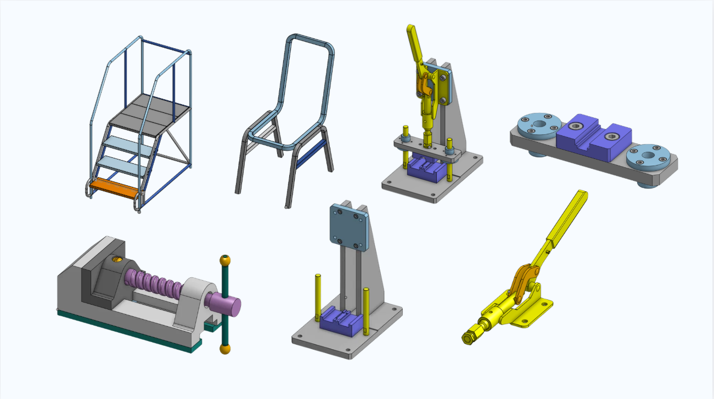

# Reverse Engineering & Assembly Practice in Onshape

### ถอดแบบและประกอบชิ้นส่วนเครื่องกลด้วย Onshape

---

## ภาพรวม / Overview

**TH** — ฝึกถอดแบบ (reverse engineering) ชิ้นงานเครื่องกลจากของจริง แล้วสร้างเป็นโมเดล 3D และประกอบเป็น assembly
ใน Onshape เน้นงานที่มีทั้งชิ้นส่วนโครงท่อ ชิ้นงานกลึง/กัด และกลไกที่มีการเคลื่อนไหว (mate) จริง

**EN** — Reverse-engineering practice: measuring real mechanical parts, rebuilding them as parametric 3D models,
and putting them together as working assemblies in Onshape — tube frames, machined parts, and linkages with real
mates and degrees of freedom.

## ชิ้นงาน / Models

## ทักษะที่ใช้ / Skills

- Parametric part modelling — sketch, extrude, revolve, sweep, sheet metal
- Assembly mates — revolute, slider, fastened, planar
- Reverse engineering จากการวัดชิ้นงานจริง
- การเขียนแบบและจัดทำเอกสารประกอบ

## โครงสร้างไฟล์ / What's in here

| ไฟล์ | เนื้อหา |
|---|---|
| [`docs/reverse-engineering-assembly-practice.pdf`](docs/reverse-engineering-assembly-practice.pdf) | เอกสารรวมงานถอดแบบและ assembly ทั้งหมด |
| [`images/onshape-models.png`](images/onshape-models.png) | ภาพรวมชิ้นงานที่ทำ |
