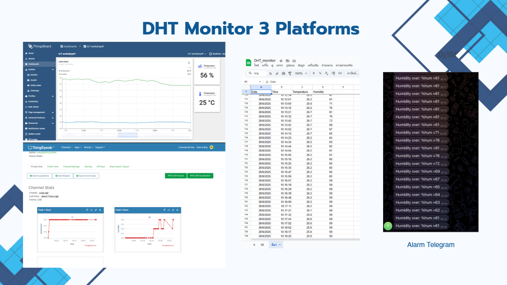

# DHT Monitor on 3 Platforms

### ส่งข้อมูลอุณหภูมิ–ความชื้นขึ้น 3 แพลตฟอร์มพร้อมกัน + แจ้งเตือน Telegram

---

## ภาพรวม / Overview

**TH** — โจทย์คือเซนเซอร์ DHT ตัวเดียว แต่ส่งข้อมูลขึ้นแพลตฟอร์ม IoT สามแบบพร้อมกัน เพื่อเปรียบเทียบว่าแต่ละแบบ
เหมาะกับงานลักษณะไหน — dashboard แบบเรียลไทม์, การวิเคราะห์ย้อนหลัง, และการเก็บข้อมูลดิบ
พร้อมเพิ่มระบบแจ้งเตือนอัตโนมัติเมื่อค่าเกินเกณฑ์

**EN** — One DHT temperature/humidity sensor streaming to three IoT platforms at once, to compare what each is
actually good at: live dashboards, historical analysis, and raw data retention — plus threshold alerting.

## แพลตฟอร์มที่ใช้ / Platforms

| แพลตฟอร์ม | ใช้ทำอะไร | จุดเด่นที่เจอ |
|---|---|---|
| **ThingsBoard** | Dashboard เรียลไทม์ — line chart อุณหภูมิ/ความชื้น + การ์ดค่าปัจจุบัน | จัดหน้า dashboard ได้ยืดหยุ่นที่สุด เหมาะกับการมอนิเตอร์สด |
| **ThingSpeak** | Channel stats + กราฟแยก field | ต่อกับ MATLAB Analysis / MATLAB Visualization ได้เลย เหมาะกับงานวิเคราะห์ |
| **Google Sheets** | เก็บ log ดิบเป็นแถว — Date, Time, Temperature, Humidity | เก็บย้อนหลังได้ไม่จำกัด ดึงไปทำต่อใน Excel/Sheets ได้ทันที |
| **Telegram** | แจ้งเตือนอัตโนมัติเมื่อความชื้นเกินเกณฑ์ | ส่งข้อความเข้ามือถือทันที ไม่ต้องเปิด dashboard เฝ้า |

## สิ่งที่ทำ / What was built

- อ่านค่าจากเซนเซอร์ **DHT** (อุณหภูมิ °C / ความชื้น %)
- ส่งข้อมูลขึ้น ThingsBoard, ThingSpeak และ Google Sheets พร้อมกันในรอบเดียว
- ตั้งเกณฑ์แจ้งเตือน — เมื่อความชื้นเกินค่าที่กำหนด ส่งข้อความเข้า Telegram อัตโนมัติ
- เก็บข้อมูลต่อเนื่องกว่า 1,000 รายการเพื่อดูแนวโน้มระยะยาว

## เทคโนโลยี / Stack

Wi-Fi microcontroller · DHT sensor · MQTT / HTTP API · ThingsBoard · ThingSpeak · Google Sheets API · Telegram Bot API

## โครงสร้างไฟล์ / What's in here

| ไฟล์ | เนื้อหา |
|---|---|
| [`images/dashboards-overview.png`](images/dashboards-overview.png) | ภาพรวม dashboard ทั้งสามแพลตฟอร์มและการแจ้งเตือน Telegram |
