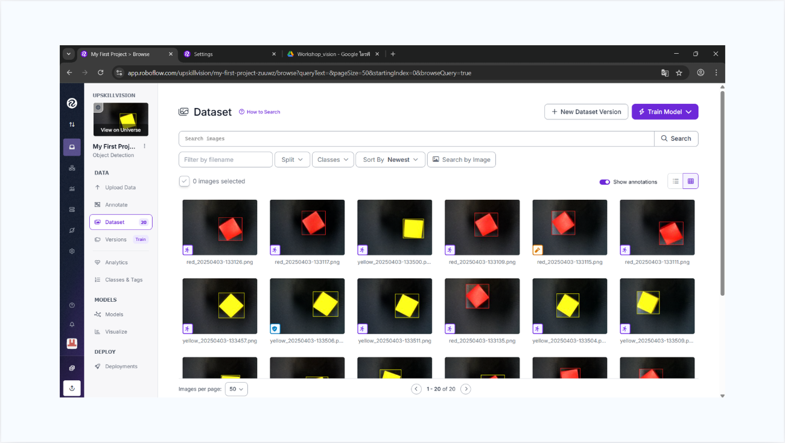

# Object Detection with Roboflow

### ทำ dataset และเทรนโมเดลตรวจจับวัตถุ

---

## ภาพรวม / Overview

**TH** — งาน computer vision ตั้งแต่ต้นทาง: ถ่ายภาพวัตถุเอง ติด bounding box แยกคลาสตามสี จัดการเวอร์ชันของ dataset
แล้วเทรนโมเดลตรวจจับวัตถุบน Roboflow เป้าหมายคือให้ระบบแยกแยะชิ้นงานตามสีได้ ซึ่งเป็นพื้นฐานของงาน
pick-and-place ที่ต้องคัดแยกชิ้นงานก่อนหยิบ

**EN** — End-to-end computer vision: capturing the images, annotating bounding boxes by colour class, versioning
the dataset, and training a detection model on Roboflow — the perception half of a colour-sorting pick-and-place task.

## Dataset



| รายการ | ค่า |
|---|---|
| จำนวนภาพ | 20 ภาพ |
| คลาส | `red` · `yellow` |
| วัตถุ | ลูกบาศก์สีแดงและสีเหลือง ถ่ายบนพื้นหลังเข้ม |
| การติดป้าย | Bounding box ทีละภาพ ครอบวัตถุแบบพอดี |
| เครื่องมือ | [Roboflow](https://roboflow.com) — annotate, version, train, deploy |

ภาพถูกถ่ายในหลายมุมและหลายการหมุนของวัตถุ เพื่อให้โมเดลทนต่อการวางชิ้นงานในทิศทางที่ต่างกัน

## ขั้นตอนที่ทำ / Pipeline

```
เก็บภาพเอง  →  Upload เข้า Roboflow  →  Annotate (bounding box + class)
                                              │
                                              ▼
                             แบ่ง train / valid / test split
                                              │
                                              ▼
                                   สร้าง dataset version
                                              │
                                              ▼
                                        Train Model
                                              │
                                              ▼
                                   ทดสอบ / Deploy
```

## ทักษะที่ใช้ / Skills

- การเตรียมและติดป้ายกำกับข้อมูลสำหรับ object detection
- การจัดการเวอร์ชันและการแบ่งชุดข้อมูล train/valid/test
- การเทรนและประเมินผลโมเดลตรวจจับวัตถุ
- ความเข้าใจพื้นฐานของ vision pipeline สำหรับงานหุ่นยนต์คัดแยกชิ้นงาน

## โครงสร้างไฟล์ / What's in here

| ไฟล์ | เนื้อหา |
|---|---|
| [`images/roboflow-dataset.png`](images/roboflow-dataset.png) | ภาพหน้าจอ dataset ที่ติดป้ายกำกับแล้วบน Roboflow |
